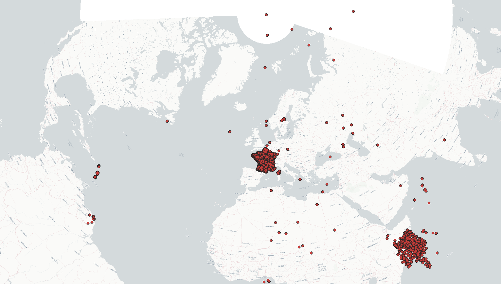

Analyse du fichier INERIS à système de coordonées multiple
--------------------

# Introduction

Fichier `tab_SpF.csv` envoyé par [Mamadou Bailo Balde](Mamadou-bailo.BALDE@ineris.fr) à [Daniel Marin](dmarin@open-dc.com) le 17/07/2023.
Ce fichier contient des informations géographiques de sources différentes, ayant des systèmes de projection différents. Ces systèmes de projection étant parfois renseignés par l'utilisateur, peuvent être non-cohérent avec les coordonnées effectivement renseignées dans la base.
Ce document présente une analyse rapide du contenu du fichier afin de voir si un module de correction automatique des coordonnées peut être réalisé.

# Présentation du fichier

Ce fichier comporte:
> - 1,211,642 enregistrements
> - 21 champs
> - 2 groupes de champs de coordonnées:
>   - `longitude`, `latitude`
>   - `longitude_annee_recente`, `latitude_annee_recente`
> - 2 groupes de champs d'information sur les systèmes de projection:
>   - `Type de projection`
>   - `Type de projection_annee_recente`

**Aperçu de la table:**

| ... | 	adresse                                   | 	commune         | 	code_insee | 	… | 	longitude | 	latitude | 	Type de coordonnées | 	Type de projection | 	annee_la_plus_recente | 	longitude_annee_recente | 	latitude_annee_recente | 	Type de coordonnées_annee_recente | 	Type de projection_annee_recente | 
|-----|--------------------------------------------|------------------|-------------|----|------------|-----------|----------------------|---------------------|------------------------|--------------------------|-------------------------|------------------------------------|-----------------------------------|
| …   | 	ZI de la GRANDE BORNE                     | 	CHATEAU-THIERRY | 	2168       | 	… | 	3.3924    | 	49.03226 | 	Vérifié             | 	WGS84              | 	2022                  | 	3.3924                  | 	49.03226               | 	Vérifié                           | 	WGS84                            |
| …   | 	ZI de la GRANDE BORNE                     | 	CHATEAU-THIERRY | 	2168       | 	… | 	3.3924    | 	49.03226 | 	Vérifié             | 	WGS84              | 	2022                  | 	3.3924                  | 	49.03226               | 	Vérifié                           | 	WGS84                            | 
| …   | 	RUE DES GRANDS NAVOIRS PROLONGEE, B.P. 48 | 	CHAUNY          | 	2173       | 	… | 	3.2259    | 	49.60741 | 	Vérifié             | 	WGS84              | 	2021                  | 	3.2259                  | 	49.60741               | 	Vérifié                           | 	WGS84                            | 

# Analyse

## Contenu des champs

Ci-dessous une analyse du nombre de valeurs uniques par type de projection:

- Champ: `Type de coordonnées`:
  - *Centroide*:  13%
  - *Déclaré*:  34%
  - *Vérifié*: 53%
	
- `Type de projection`:
  - *Lambert II*:     30%
  - *WGS84*:    70%
	
- `Type de coordonnées_annee_recente`:
  - *Centroide*: 5%
  - *Déclaré*:	42%
  - *Vérifié*	53%
	
- `Type de projection_annee_recente`:
  - Lambert II:     38%
  - WGS84: 62%

## Distribution géographique de la donnée

**30.1%** des enregistrements sont hors de France (notons que pour certains enregistrements cela peut être légitime).

## Méthode de correction automatique:

*Note*: On suppose que la donnée WGS84 peut se trouver n'importe où dans le monde, avec des coordonnées angulaires entre -180 et +180 degrés. La donnée Lambert II en revanche n'est censée être valide qu'en France. On définit donc une couverture englobant (grossièrement) la France.

> - Définition des intervalles de légitimité des coordonnées WGS84 (`[-180, 180]`) et Lambert II (`{'minx': 72525.7, 'miny': 1614430.5, 'maxx': 1223160.4, 'maxy': 2683676.9}`)
> - Identification des coordonnées non WGS84 (par leur valeur et non par le champ `Type de projection`)
> - Supposition Lambert II et conversion en WGS84
> - Création de champs homogènes `longitude WGS84` et `latitude WGS84` dans lequel on stocke la donnée d'origine si elle est déjà en WGS84, la donnée convertie si elle était en Lambert II.

On obtient ainsi **10.7%** des enregistrements toujours hors de France. Ci-dessous un échantillon des enregistrements toujours hors de France:

## Aperçu des enregistrements restant hors de France

On donne ci-après un aperçu des valeurs brutes de `latitude` et `longitude` toujours hors de France. 
- Certaines sont légitimes (cf. `-63.08026`, `18.0769` Baie de la Potence à Saint-Martin)
- certains sont en longitude latitude avec des expressions litérales (cf. `49°21.54N(GPS)`, `1°21.56E(GPS)`)
- certains en Lambert II avec expression litérales (cf. `987417m`, `2322509m`)
- certains non renseignés (`nonconnues`, `néant`, `ND`, `?`, ` `, etc.)
- etc.

| … | adresse                                     | commune              | code_insee | …2 | **longitude**   | **latitude**    | Type de coordonnées | Type de projection | …3 | longitude WGS84 | latitude WGS84 | tmp | len |
|---|---------------------------------------------|----------------------|------------|----|-----------------|-----------------|---------------------|--------------------|----|-----------------|----------------|-----|-----|
| … | Baie de la Potence                          | SAINT-MARTIN         | 97127      | …  | -63.08026       | 18.0769         | Vérifié             | WGS84              | …  | -63.08026       | 18.0769        | 9   | 9   |
| … | CS 621- ZI du Capiscol - Avenue J. Foucault | BEZIERS              | 34032      | …  | 675062675620    | 114754115188    | Déclaré             |                    | …  | -161.3677381    | -89.99838625   | 7   | 12  |
| … | BP 81 - ZIP Ouest                           | LOON-PLAGE           | 59359      | …  | N5059.11        | E20°106'        | Déclaré             |                    | …  |                 |                | 6   | 8   |
| … | Rue des Romains                             | FLORANGE             | 57221      | …  | longitudeEst6°8 | latitudeNord49° | Déclaré             |                    | …  |                 |                | 6   | 15  |
| … | BP 37                                       | OTTMARSHEIM          | 68253      | …  | 987417m         | 2322509m        | Déclaré             |                    | …  |                 |                | 6   | 7   |
| … | Chemin du Sang de Serp                      | TOULOUSE             | 31555      | …  | 526.710.000     | 146.467.000     | Déclaré             |                    | …  |                 |                | 6   | 11  |
| … | Route de la Chimie / Route de la Plaine     | GONFREVILLE-L'ORCHER | 76305      | …  | nonconnues      | nonconnues      | Déclaré             |                    | …  |                 |                | 2   | 10  |
| … | 15-23 avenue Georges Ferrenbach             | KAYSERSBERG          | 68162      | …  | néant           | néant           | Déclaré             |                    | …  |                 |                | 2   | 5   |
| … | Pfizer PGM - 10, rue Bouché-Thomas - BP 723 | ANGERS               | 49007      | …  | ND              | ND              | Déclaré             |                    | …  |                 |                | 2   | 2   |
| … | ZI Flourens BP3                             | FLOURENS             | 31184      | …  | M43°35mn49.8s   | E1°32mn33.7s    | Déclaré             |                    | …  |                 |                |     | 13  |
| … | route de Bazancourt                         | POMACLE              | 51439      | …  | 732.6m          | 2484.7mZ:87m    | Déclaré             |                    | …  |                 |                |     | 6   |
| … | Usine Saint Victor - B.P. 27                | FLEURY-SUR-ANDELLE   | 27246      | …  | 49°21.54N(GPS)  | 1°21.56E(GPS)   | Déclaré             |                    | …  |                 |                |     | 14  |
| … | 111, rue de la Vallée                       | HAVRE                | 76351      | …  | 0°9             | 49°30           | Déclaré             |                    | …  |                 |                |     | 3   |
| … | BP 11 ZI de Peyrehitte                      | OGEU-LES-BAINS       | 64421      | …  | 0°20            | 43°10           | Déclaré             |                    | …  |                 |                |     | 4   |
| … | 6 avenue des frères Lumière B.P.3           | GENAY                | 69278      | …  | ?               | ?               | Déclaré             |                    | …  |                 |                |     | 1   |
| … | 154 - 156 RUE SAINT ACHEUL                  | AMIENS               | 80021      | …  | 2.33056E+16     | 4.98854E+15     | Déclaré             | WGS84              | …  | \-160.3461765   | \-89.9984027   |     | 17  |
| … | 1 route nationale - Le Gol                  | SAINT-LOUIS          | 97414      | …  | 10269939.95     | 3873931.194     | Déclaré             | Lambert II         | …  | 92.73917721     | 8.146146165    |     | 16  |
| … | 7, rue Principale                           | BEINHEIM             | 67025      | …  |                 |                 | Déclaré             |                    | …  |                 |                |     | 0   |

# Conclusions

Il est possible de convertir environ 90% des enregistrements en WGS84 automatiquement en supposant que tout ce qui n'est pas WGS84 est Lambert II.
Pour les 10% restants, une analyse plus fine utilisant:
- des expressions régulières pour convertir des entrées litérales en nombres
- des tests sur d'autres systèmes de projection (notamment Lambert 93 qui est le système officiel en cours) sont nécessaires pour les données en mètres qui ne semblent pas provenir du système Lambert II.

Il s'agit là d'opération très spécifiques, qui à mon sens doivent être réalisées en dehors du projet [qualigeoenvi.fr](https://qualigeoenvi.fr/) qui se veut générique et non rattaché à un cas d'usage particulier.
Le développement d'un script python pour traiter ce type de fichier est tout à fait envisageable. 